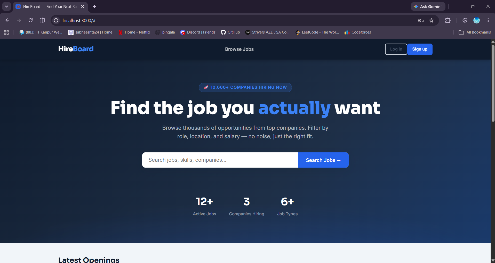
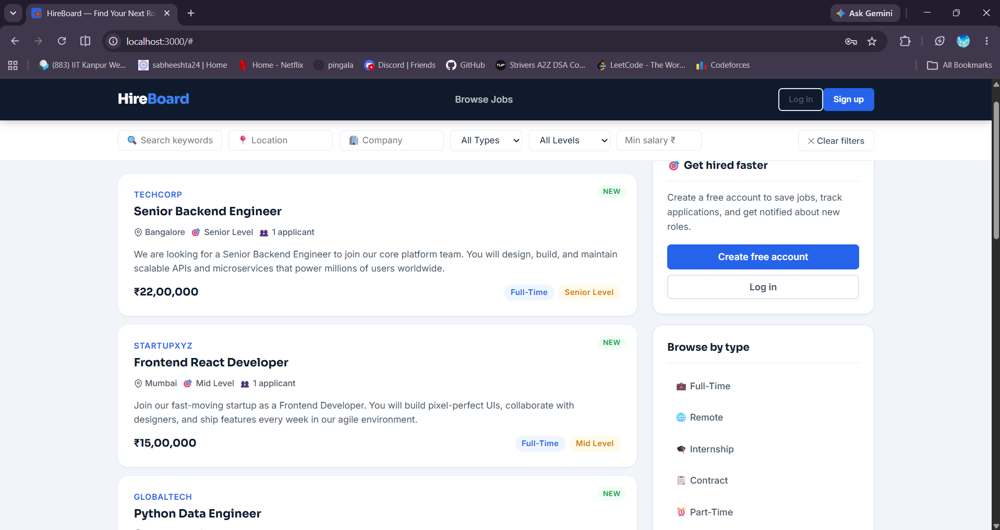
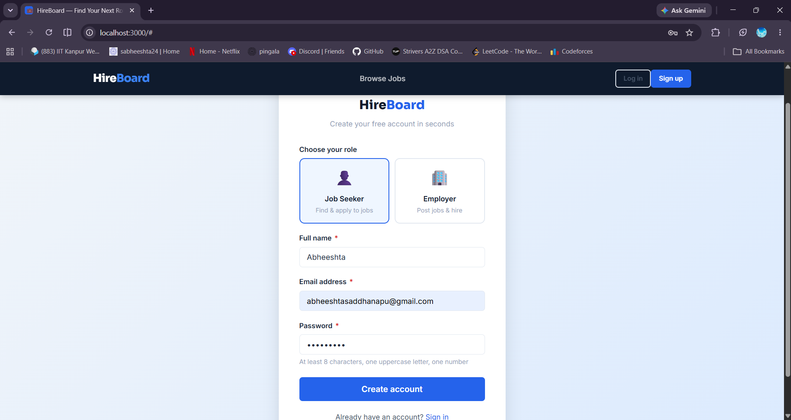
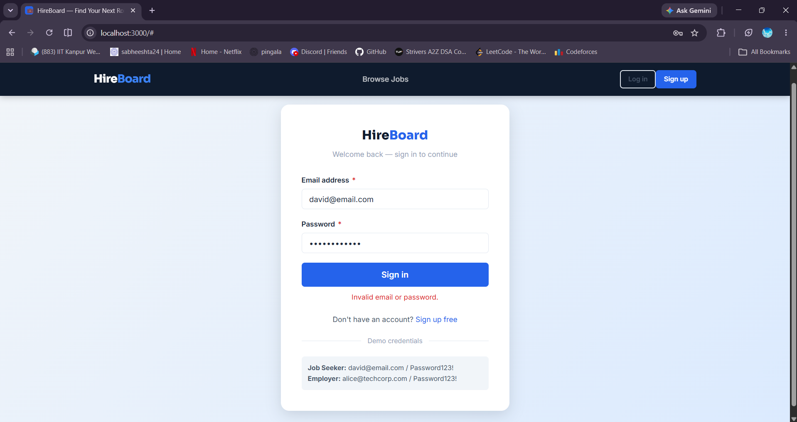
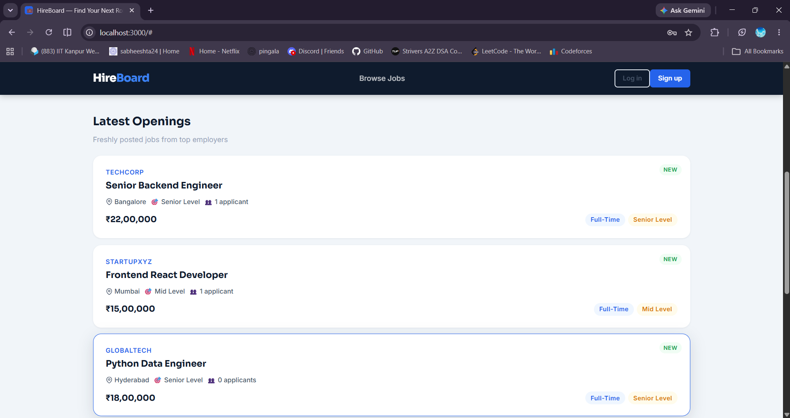

# HireBoard

Full-stack job portal built with Node.js, Express.js, PostgreSQL, and Vanilla JavaScript.


---
## Screenshots

### Home Page


### Job Listings


### Sign-up page


### log-in page


### dashboard page


## 📸 Features

| Feature | Detail |
|---|---|
| **Auth** | JWT (HttpOnly cookie) + bcrypt password hashing |
| **Roles** | `employer` — post/edit/delete jobs, manage applicants · `job_seeker` — apply, save, track |
| **Jobs** | Full CRUD with filtering by location, company, type, salary, experience level |
| **Search** | PostgreSQL full-text search (`GIN` index) across title, description, company |
| **Pagination** | Server-side with `LIMIT / OFFSET`, metadata in response |
| **Applications** | Apply with cover letter, track status, withdraw; employer updates status |
| **Saved Jobs** | Bookmark jobs for later; single-row `ON CONFLICT DO NOTHING` upsert |
| **Security** | Parameterised queries (no SQL injection), input validation, XSS escaping, CSRF via SameSite cookie |
| **Frontend** | Single-page app — no framework, pure vanilla JS routing |

---
## What I Learned

- Designing relational database schemas in PostgreSQL
- Building REST APIs with Express.js
- Implementing JWT authentication and role-based access control
- Writing parameterized SQL queries to prevent SQL injection
- Building server-side filtering and pagination
- Managing PostgreSQL connections using pg.Pool

## 🗂 Project Structure

```
job-board/
├── server.js               # Express entry point
├── .env                    # Secrets (never commit this)
├── .env.example            # Template for teammates
├── config/
│   └── db.js               # PostgreSQL connection pool
├── database/
│   └── schema.sql          # All DDL + seed data
├── models/                 # SQL queries (Model layer)
│   ├── User.js
│   ├── Job.js
│   ├── Application.js
│   └── SavedJob.js
├── controllers/            # Request handlers (Controller layer)
│   ├── authController.js
│   ├── jobController.js
│   ├── applicationController.js
│   └── savedJobController.js
├── routes/                 # Express routers (URL → controller)
│   ├── auth.js
│   ├── jobs.js
│   ├── applications.js
│   └── savedJobs.js
├── middleware/
│   ├── auth.js             # JWT protect / requireRole / optionalAuth
│   ├── validate.js         # express-validator rules
│   └── errorHandler.js     # Centralised error responses
├── utils/
│   └── jwt.js              # Token generation + cookie helper
└── public/                 # Static frontend (served by Express)
    ├── index.html          # SPA shell
    ├── css/style.css
    └── js/app.js           # All frontend logic
```

---

## ⚡ Quick Start

### Prerequisites

- **Node.js** v18+ (`node -v`)
- **PostgreSQL** v14+ (`psql --version`)

### 1 — Clone and install

```bash
git clone https://github.com/yourname/job-board.git
cd job-board
npm install
```

### 2 — Set up environment variables

```bash
cp .env.example .env
```

Edit `.env` with your PostgreSQL credentials:

```env
PORT=3000
NODE_ENV=development

DB_HOST=localhost
DB_PORT=5432
DB_NAME=job_board
DB_USER=postgres
DB_PASSWORD=your_postgres_password

JWT_SECRET=change_this_to_a_long_random_string_minimum_32_chars
JWT_EXPIRES_IN=7d
```

### 3 — Create the database and load schema

```bash
# Create the database
psql -U postgres -c "CREATE DATABASE job_board;"

# Load schema + seed data
psql -U postgres -d job_board -f database/schema.sql
```

You should see: `Schema and seed data loaded successfully!`

### 4 — Start the server

```bash
# Development (auto-restart on file changes)
npm run dev

# Production
npm start
```

Open **http://localhost:3000** in your browser.

---

## 🔑 Demo Accounts

All demo accounts use the password: **`Password123!`**

| Role | Email |
|---|---|
| Job Seeker | `david@email.com` |
| Job Seeker | `emma@email.com` |
| Employer | `alice@techcorp.com` |
| Employer | `bob@startupxyz.com` |

---

## 🌐 REST API Reference

### Authentication

| Method | Endpoint | Auth | Description |
|---|---|---|---|
| `POST` | `/api/auth/register` | Public | Create account |
| `POST` | `/api/auth/login` | Public | Login, returns JWT |
| `POST` | `/api/auth/logout` | Public | Clear cookie |
| `GET` | `/api/auth/me` | 🔒 Any | Get own profile |
| `PUT` | `/api/auth/profile` | 🔒 Any | Update name/bio |

**Register body:**
```json
{
  "name": "Jane Smith",
  "email": "jane@example.com",
  "password": "Password123!",
  "role": "job_seeker"
}
```

---

### Jobs

| Method | Endpoint | Auth | Description |
|---|---|---|---|
| `GET` | `/api/jobs` | Public | List jobs (filterable, paginated) |
| `GET` | `/api/jobs/:id` | Public | Get job detail |
| `POST` | `/api/jobs` | 🔒 Employer | Create job posting |
| `PUT` | `/api/jobs/:id` | 🔒 Employer (owner) | Edit job |
| `DELETE` | `/api/jobs/:id` | 🔒 Employer (owner) | Delete job |
| `GET` | `/api/jobs/employer/my-jobs` | 🔒 Employer | Own postings + stats |
| `GET` | `/api/jobs/:id/applicants` | 🔒 Employer (owner) | View applicants |
| `PATCH` | `/api/jobs/:id/applicants/:appId` | 🔒 Employer (owner) | Update application status |

**Filter examples:**

```
GET /api/jobs?location=Bangalore
GET /api/jobs?job_type=Remote
GET /api/jobs?company=TechCorp
GET /api/jobs?minSalary=1000000&maxSalary=3000000
GET /api/jobs?search=python
GET /api/jobs?experience_level=Senior%20Level
GET /api/jobs?page=2&limit=10
GET /api/jobs?location=Mumbai&job_type=Full-Time&minSalary=800000
```

---

### Applications

| Method | Endpoint | Auth | Description |
|---|---|---|---|
| `POST` | `/api/jobs/:id/apply` | 🔒 Job Seeker | Apply for a job |
| `GET` | `/api/applications` | 🔒 Job Seeker | My applications |
| `DELETE` | `/api/applications/:id` | 🔒 Job Seeker | Withdraw application |

**Apply body:**
```json
{ "cover_letter": "I'm excited about this role because…" }
```

---

### Saved Jobs

| Method | Endpoint | Auth | Description |
|---|---|---|---|
| `POST` | `/api/jobs/:id/save` | 🔒 Job Seeker | Save a job |
| `DELETE` | `/api/jobs/:id/save` | 🔒 Job Seeker | Unsave a job |
| `GET` | `/api/saved-jobs` | 🔒 Job Seeker | My saved jobs |

---

## 🗄 Database Schema

```sql
users (id, name, email, password_hash, role, bio, avatar_url, created_at)
  └──< jobs (id, title, company, location, salary, job_type, description,
             requirements, benefits, experience_level, posted_by→users, is_active, created_at)
              └──< applications (id, user_id→users, job_id→jobs, cover_letter, status, applied_at)
              └──< saved_jobs   (id, user_id→users, job_id→jobs, saved_at)
```

**Key SQL techniques used:**
- `JOIN` across 3 tables (jobs + users + applications)
- `GIN` index for full-text search
- `COUNT(DISTINCT ...)` for application counts per job
- Parameterised queries (`$1, $2`) throughout — no string interpolation
- `ON CONFLICT DO NOTHING` for idempotent saves
- `COALESCE` for partial updates (PATCH-style PUT)
- Trigger function to auto-update `updated_at`
- `CHECK` constraints on `role`, `job_type`, `status`, `experience_level`

---

## 🔒 Security Notes

| Concern | How it's handled |
|---|---|
| SQL Injection | 100% parameterised queries via `pg` library |
| XSS | All user content escaped with `esc()` before `innerHTML`; `textContent` used where possible |
| Password storage | `bcrypt` with cost factor 12 |
| JWT | Stored in `HttpOnly` cookie (JS cannot read it) + `SameSite=strict` |
| CSRF | `SameSite=strict` cookie policy |
| Input validation | `express-validator` on all POST/PUT endpoints |
| Role enforcement | Middleware checks role before every protected action |
| Ownership checks | Employer can only edit/delete their *own* jobs |

---

## 🧠 Key Learning Points

This project intentionally demonstrates these backend concepts:

1. **MVC Architecture** — Models handle SQL, Controllers handle HTTP, Routes wire them together
2. **JWT Auth flow** — Sign on login → verify on every protected request → revoke via cookie expiry
3. **RBAC** — `requireRole('employer')` middleware pattern; ownership checks in controllers
4. **Parameterised SQL** — `db.query('SELECT * FROM jobs WHERE id = $1', [id])` prevents injection
5. **Dynamic WHERE clauses** — Building filter arrays conditionally, then joining with `AND`
6. **Pagination** — `LIMIT $n OFFSET $m`, return total count for client-side UI
7. **Full-text search** — PostgreSQL `to_tsvector` + `GIN` index + `plainto_tsquery`
8. **Error handling** — `next(err)` pattern funnels all errors to one handler
9. **Connection pooling** — `pg.Pool` reuses connections across requests

---

## 🚀 Deployment (Railway / Render)

1. Push code to GitHub
2. Create a new project on [Railway](https://railway.app) or [Render](https://render.com)
3. Add a **PostgreSQL** plugin/database
4. Set environment variables from `.env.example`
5. Set start command: `node server.js`
6. Run `psql $DATABASE_URL -f database/schema.sql` to initialise the DB

For production, also set `NODE_ENV=production` which enables `secure` cookies (HTTPS only).

---

## 📦 Dependencies

| Package | Purpose |
|---|---|
| `express` | Web framework |
| `pg` | PostgreSQL driver |
| `bcryptjs` | Password hashing |
| `jsonwebtoken` | JWT sign & verify |
| `cookie-parser` | Read HttpOnly cookies |
| `express-validator` | Input validation |
| `dotenv` | Load `.env` file |
| `nodemon` (dev) | Auto-restart on changes |
